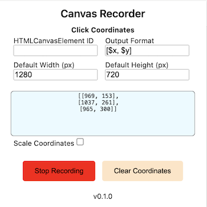

# Record actions on the HTML Canvas element

This repository contains the files for a Chrome browser extension that can record actions on an HTML Canvas element. Currently only supports recording of mouse clicks.

## Features

- Click coordinates recording
    - define output formatting
    - set default width/height for scaling click positions

## Install

1. Clone the repository
2. `cd` to cloned repository
3. `npm i -D`
4. `npm run build`
5. Chrome Menu -> More Tools -> Extensions -> Toggle on `Developer mode` -> Load unpacked
6. Select the `build` folder (NOT the root folder - this will not work)

## Contribution

Suggestions and pull requests are welcomed!.

## Example

---

This project was bootstrapped with [Chrome Extension CLI](https://github.com/dutiyesh/chrome-extension-cli)
